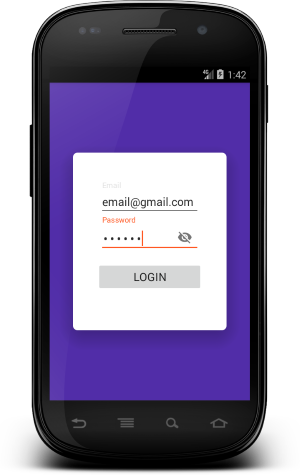
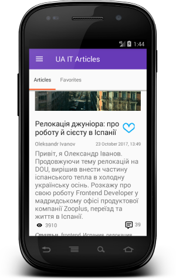

# UA IT Articles

Simple Android app that showcases UA IT Articles.
 
## Project Structure
### Data 
It contains all the data(Shared Preferences, Local DB and Remote API) accessing and manipulating components.
### Injection
Dependency providing classes using Dagger2.
### Events
EventBus events classes that simplifies communication between Activities and Fragments/
### UI
View classes along with their corresponding Presenters.
### Utils
Utility classes.

## Preview

Login|Articles List 
-------------|-----------------
  |   

## Library reference resources
- [Support library](https://developer.android.com/topic/libraries/support-library/index.html)
- [RxJava2](https://github.com/ReactiveX/RxJava), [RxAndroid](https://github.com/ReactiveX/RxAndroid) and [RxBindings](https://github.com/JakeWharton/RxBinding)
- [Dagger2](https://google.github.io/dagger/)
- [Retrofit2](http://square.github.io/retrofit/)
- [Okhttp3](https://github.com/square/okhttp/)
- [ButterKnife](https://github.com/JakeWharton/butterknife)
- [EventBus(GreenRobot)](http://greenrobot.org/eventbus/)
- [Timber](https://github.com/JakeWharton/timber)
- [Calligraphy](https://github.com/chrisjenx/Calligraphy)
- [LeakCanary](https://github.com/square/leakcanary)
- [Joda-Time](http://joda-time.sourceforge.net/)
- [Fresco](https://github.com/facebook/fresco/)

## Testing reference resources
- [Mockito](http://site.mockito.org/)
- [Robolectric](http://robolectric.org/) 

Developed By
-------
Ihor Havryliuk (Graviton57)

[1]: https://github.com/graviton57/ITAtricles.git
